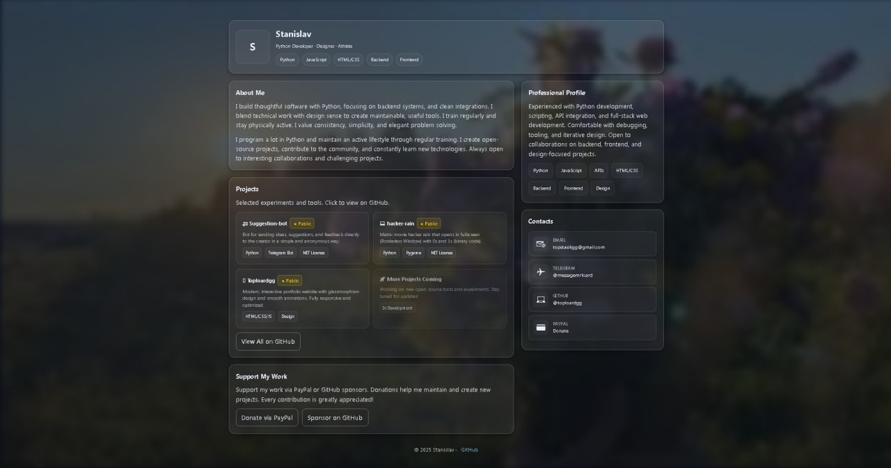

# Toploardgg Portfolio

Welcome to **toploardgg.github.io** – a personal portfolio site showcasing the work, biography, and projects of Stanislav (Stas). This site serves as a central hub for my professional journey, creative endeavors, and ways to connect.

## Table of Contents

- [About the Site](#about-the-site)
- [Features](#features)
- [Technologies](#technologies)
- [Screenshots](#screenshots)
- [Updates](#updates)
- [Contact](#contact)
- [License](#license)
- [Contributing](#contributing)

## About the Site

This is a dynamic portfolio website dedicated to Stanislav's life, achievements, and ongoing projects. It includes:

- **Biography**: A comprehensive overview of Stas's life story, professional history, skills, and experiences.
- **Portfolio Showcase**: Highlights of projects, including code repositories, tools like "loard", and other developments.
- **Updates**: Regular additions of new content, blog posts, project updates, and news to keep the site fresh and engaging.
- **Contact**: Direct ways to reach out for collaborations, feedback, or inquiries.

The site is designed for simplicity, speed, and accessibility, making it easy to navigate and explore.

## Features

- **Responsive Design**: Works seamlessly on desktops, tablets, and mobiles.
- **Interactive Elements**: JavaScript-powered features for dynamic content loading and user interactions.
- **Biography Section**: Detailed narrative of personal and professional milestones.
- **Project Gallery**: Showcases open-source tools, scripts, and utilities (e.g., network scanning tools like "loard").
- **Blog/Updates Feed**: Chronological posts about recent developments and tech insights.
- **Contact Form**: Easy communication options, including email and social links.

## Technologies

The website is built using a clean, modern tech stack for optimal performance and maintainability:

  

- **HTML5**: For semantic structure and content organization.
- **CSS3**: For styling, animations, and responsive layouts.
- **JavaScript**: For interactivity, such as dynamic updates and form handling.
- **GitHub Pages**: Hosted directly on GitHub for free, reliable deployment.
- **Markdown Support**: Easy content management for biographies and updates.

No heavy frameworks are used to ensure fast load times and broad compatibility.

## Screenshots

Here are some previews of the site:

(For the full experience, visit the live site!)

## Updates

The site is actively maintained and evolving:
- **January 2026**: Added new project showcases and updated biography.
- **Frequent Additions**: New materials, blog posts, and features are added regularly. Check back often or subscribe to updates via RSS/email.

## License

This project is licensed under the MIT License. See the [LICENSE](LICENSE) file for details.

## Contributing

Contributions are welcome! If you'd like to suggest improvements, fix bugs, or add features:
1. Fork the repository.
2. Create a new branch (`git checkout -b feature/YourFeature`).
3. Commit your changes (`git commit -m 'Add some feature'`).
4. Push to the branch (`git push origin feature/YourFeature`).
5. Open a Pull Request.
